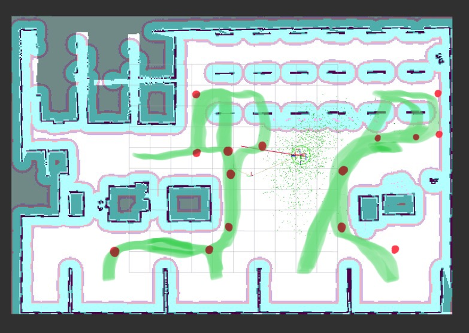
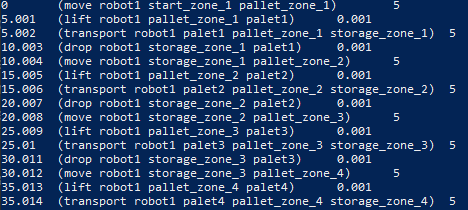
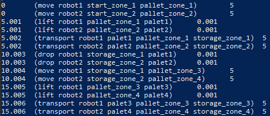

# Collaborative Robotics
>Group24: Conner Moore cm4841@nyu.edu, Dhruv Vajpeyi dv2086@nyu.edu, Shikun Cui sc8186@nyu.edu

## Task2
### Video demonstration available at: https://drive.google.com/file/d/1d4eYB58mY4qdrVRqWmRYF7lLDSdUz9lZ/view
The planner initially defined in the exercise did not work as intended. The main issues faced were that 
- the robot sensors would get blocked when lifting palets, causing the robots to build inaccurate costmaps and get stuck.
- robots that were not close to known objects in the world would not be able to improve confidence in their positioning. This lead to inaccurate estimation of the robot position in the world, especially for robot1.
- the robots would not update the ground truth of the warehouse model that they start with. Even after moving palets, the robots expect the palet to be in their original location. This causes them to take unnecessary routes, but does not get them stuck.
- when determining the costmap, the bot does not take into account the palet it is carrying. Since the palet is much larger than the bot, it may still bump into objects while being carried.
We addressed these issues in a number of ways.

#### Planner Idea
>The major idea of this planner is adding a number of middle points to give the robots more specific paths and regions in which t*o* move.

>We also intentionally directed the robots to stay near objects and walls in the world, in doing so the robot would gain and maintain confidence in its relative position in the world via its LiDAR system. 

>The original FollowTarget client in the exercise only sends xyz pose data as goals; we modified it to send a rotation angle as well. This way we can choose the specific robot orientation at each waypoint, leading to better lifting of the pallets.

> The FollowTarget client sends 2 and -2 to the lift server. We determined that this is an effort value. Increasing it caused the robot to lift the pallets higher, causing less sensor blockage.

#### Planner result
>Through most trials, the planner will successfully achieve the task. Robot 1 will carry pallet 6 and pallet 5 to the storage location 1 and storage location 2 respectively. Robot 2 will carry pallet 1 and pallet 2 to the storage location 4 and storage location 3 respectively. In a few instances, Robot 1 will become stuck on the rightmost wall. 

#### Planner details
* First, we added the rotation feature to every pre-set location and the angle is calculated by radians. Rotation 0(3.14) means the robot will face up(down). For example, 
```
'pallet_1': {'x_pose': 3.64, 'y_pose': 0.63, 'z_pose': 0.01, 'rotation': 3.14}
```
"'rotation': 3.14" means that we want the robot to load the pallet 1 with a face-down posture. 

* Second, we modified the load function. Instead of using original load(2) and unload(-2), we used a new load parameter, 'pload': 4. Through experiments, we found in most cases, the legs of pallets will block the sensors of robots, and the number of load indicates the height of lifting, so we decided to make the loaded pallet higher to avoid that problem. Hence, we set new load, pload, as 4.

* Third, a list of middle points was added:
```
middlepoint = {
    'preentrance_left': {'x_pose': 0.97, 'y_pose': 2.3, 'z_pose': 0.01, 'rotation': -1.5708},
    'entrance_left': {'x_pose': 3.58, 'y_pose': 2.3, 'z_pose': 0.01, 'rotation': 0},
​
    'preentrance_right1': {'x_pose': 0.97, 'y_pose': -6.91, 'z_pose': 0.01, 'rotation': -1.5708},
    'preentrance_right2': {'x_pose': 0.97, 'y_pose': -9.88, 'z_pose': 0.01, 'rotation': -1.5708},
    'entrance_right': {'x_pose': 3.58, 'y_pose': -9.88, 'z_pose': 0.01, 'rotation': 0},
​
    'exit1': {'x_pose': 0.97, 'y_pose': 0.49, 'z_pose': 0.01, 'rotation': 3.14},
    'exit2': {'x_pose': 0.97, 'y_pose': -1.56, 'z_pose': 0.01, 'rotation': 3.14},
​
    'exit5': {'x_pose': 0.97, 'y_pose': -6.91, 'z_pose': 0.01, 'rotation': 3.14},
    'exit6': {'x_pose': 0.97, 'y_pose': -9.0, 'z_pose': 0.01, 'rotation': 3.14},
    'middle_right_down': {'x_pose': 0.9, 'y_pose': -5.7, 'z_pose': 0.01, 'rotation': 3.14},
    'middle_right_up': {'x_pose': 0.9, 'y_pose': -5.7, 'z_pose': 0.01, 'rotation': 0} ,
​
    'middle_left_down': {'x_pose': 0.9, 'y_pose': 0.63, 'z_pose': 0.01, 'rotation': 3.14},
    'middle_left_up': {'x_pose': 0.9, 'y_pose': 0.63, 'z_pose': 0.01, 'rotation': 0},
​
    'storage_entrance0': {'x_pose': -4.24, 'y_pose': -8.0, 'z_pose': 0.01, 'rotation': 3.14},
    'storage_entrance2': {'x_pose': -4.24, 'y_pose': 1.12, 'z_pose': 0.01, 'rotation': 3.14},
    'storage_entrance3': {'x_pose': -4.24, 'y_pose': 6.12, 'z_pose': 0.01, 'rotation': 3.14},
​
    'bottom_left_down': {'x_pose': -4.24, 'y_pose': 0.63, 'z_pose': 0.01, 'rotation': 3.14},
    'bottom_right_down': {'x_pose': -4.24, 'y_pose': -5.7, 'z_pose': 0.01, 'rotation': 3.14}
}  
```

>The added middle points are indicated by the red dots in the above image and the green line areas are the approximate moving areas of Robot 1 and Robot 2. Middle points were selected by choosing points close enough to some obstacles becasue we find that if robots can sense more surroundings, the robots' confidence area will be more concentrated, and it will adjust it's estimated location more accurately, leading to better pathing. From the image we can see that Robot2's moving area is mostly on the left side and Robot1's moving area is mostly on the right side, which will allow these two robots to deliver the pallets simultaneously without collision. 

> Since the bots always think there are palets in the palet locations due to a constant model, they will not carry the palets directly downward. Since they must exit from the sides, we must be explicit that they take the outer palets first.

> The bot confidence is indicated by the area of the dot matrix around it. A more concentrated blob means the bot is more confident in its estimation. In the image the confidence is very poor, as the bot starts far away from any known objects.
#### Other Issues Faced


* Another issue that came up was we noticed Robot2 was picking up and attempting to deliver pallet2 first, although we had written for it to deliver pallet 1 first. We noticed that this was most likely caused by the robot picking up pallet1, not finding a viable path towards the storage location, and therefore moving onto its next goal of picking up pallet2. This was because the behavior tree used allows for skipping goals. This was also remedied through better planning in our waypoint system. 

* We also faced difficulty in receiving feedback back from both robots. We would only see feedback from Robot1, which led to difficulties in figuring out what exactly robot 2 was doing.

* An aspect of the Amazon Warehouse system that could lead to difficulties in a more complex and involved problem than ours, is that the designers labeled the locations of the pallet as a ground truth in the warehouse world. This meant that even after delivery, the robots would still always believe there was an obstacle where the original pallets were, even if they had already been delivered, and even though they were not detected on their LiDAR sensors. This restraint in the world did not create too many difficulties for us, but could certainly be a hindrance for a more complex and involved problem in the warehouse world. 

#### Future Improvements

* We haven't utilized the Feedback Information. In the future, it will be a good idea to use the Feedback Information to bring some interactions between two robots. For our current planner, there's no communication between the two robots and all paths are preset. If the robots can comminicate well, the Robot 1 can also pick up the pallets from left instead of right, which will lead to a more stable planner, because the Robot 1 sometimes may run into the right wall.

* The solution of avoiding the misinformation of the legs of loading pallets can be imporved. During the transporting, the legs of the pallets always block the sensors, and the pallets will also spin when the robots are spinning around to find the path. Currently, our solution is simply lift the pallets higher and orient ourselves to avoid those missdetection, but more complicated and efficient methods are worthy of being discussed. For example, hardware-wise, we can add more function to the robots to fix the posture of the loaded pallets or software-wise, we can add features to ignore the legs if the objects are close enough.

* More variant planners can be added. Because we only had limited time and we were not familiar withe the structures and functions of the robots, we only used simple Followtargets to complete the planner. We did experiment with making other ActionClients that communicate with the default Nav2 actions. exercise/multi-robot.py includes a SpinClient that we implemented and can cause the robot to spin a certain angle. Similarly we could have clients for backup, wait and followpath. We did not have solutions that required these actions, but a more complicated planner could potentially use them. 

* We also did not use any of the published topics such as scan or odom. Given more time, we could make a better planner that subscribes to the published nav2 topics and uses the topic data to make planning decisions, instead of generating a static plan at the start. This may also help recover from fail states.

* We extensively read through the multirobot code and found that the follow target action server was implemented in amazon_robot_controller, along with it's behavior trees. The lengthiest but most robust approach would be to implement our own action servers, which can be used by future planners. While FollowTargets is enough for a simple problem, it is implemented in a way that ties all waypoint travel goals as well as palet loading into a single message from the client. Ideally, we would implement action servers that are more modular and perform smaller tasks, then provide feedback. This way the planner can perform an action, get feedback and decide the next action instead of sending the whole plan in one action.


## Task 3
#### Integrating Plansys2 with JDE MultiRobot Environment
>Initial installation of Plansys2 inside the Multirobot docker container involved creating a new plansys workspace, and cloning the sources for additional dependencies that could not be found by rosdep. The process has been saved in the shell script plansys.sh. 
#### Running Plansys Behavior Tree Example
>To understand how Plansys worked, we ran the example in ros2_planning_system_examples/plansys2_bt_examples. <br>
Steps involved
-  Launch a nav2 simulation, similar to our AWS Warehouse Multirobot simulation. The example has a simple world with a single robot.
- Launch plansys2 /w a launch script. The launch script tells Plansys which PDDL to load for the domain, and points to the behavior trees that implement the domain actions. The behavior tree nodes are implemented in C++. In the example we found Move.cpp which sent goal messages to the "navigate_to_pose" action server which is initialized by the previous Nav2 step. Some other nodes are simulations that print actions to stdout.
- Run a plansys terminal. This connects to the plansys instance created in the previous step. From here we can observe our domain as well as define our problem. The problem as defined in the tutorial has missing predicates without which it does not work. The missing predicates are 
 - set predicate (robot_available r2d2) 
 - set predicate (battery_full r2d2)
 - set predicate (piece_is_sterwheel steering_wheel_1)
- Running get plan in the plansys terminal generates the following plan
 - 0       (move r2d2 wheels_zone assembly_zone)   5
 - 5.001   (assemble r2d2 assembly_zone wheel_1 body_car_1 steering_wheel_1 car_1) 5

>The RViz window shows the bot receive the command and navigate to the pose. Zone coordinates are defined in params.yaml, so we can use zone names in our pddl which refer to xyz poses in our nav2 system.
#### Creating a PDDL for the Multirobot Domain
> We modified the plansys tutorial to instead work in the domain of the Multirobot Warehouse problem. The full pddl is in plansys_multirobot/pddl.

> Our types are robots, palets and zones. Palets and robots are subtyppes of physical object, which makes it easier to define common predciates. Specific zones are defined in params.yaml.

> Our predicates are -
- **free ?robot** : The robot is free to perform an action.
- **at ?physical_object ?zone** : The object(robot or pallet) is at zone
- **no-palet ?zone** : There is no palet at the zone. We wanted to use the predicate has-palet, so that we would have to set the predicate only for the zones with palets. However, the popf solver used in Plansys by default does not allow negative preconditions for actions, so a condition like not(has-pallet zone1) was not allowed. We need this precondition when we are transporting pallets to new locations.
- **no-robot ?zone** : There is no robot at the zone. This is a solution to the same issue as no-palet/has-palet. We have to set this predicate for a majority of the defined zones in the problem.
- **unloaded ?robot** : Robot is not carrying a palet
- **holding ?robot ?palet** : Robot is holding palet

> Our actions are -
- **move ?robot ?zone1 ?zone2** : The robot moves from zone1 to zone2. Robot must be at zone1; No other robot must be present at zone2; Robot must be free to act; The robot is unloaded.
- **transport ?robot ?palet ?zone1 ?zone2** : This works the same as move, but we use a separate action so that we can distinguish if a palet is changing zone as well. Additional conditions are the robot must be holding the palet and there must not be another palet at the destination. NOTE: move and transport are both durative-actions so that we can indicate that they take time, and other actions can happen in parallel. We set the duration to 5 seconds. With more time to learn and implement the PDDL we would figure out a way to dynamically set the duration depending on distance between zones.
- **lift ?robot ?palet ?zone** : Lift up the palet at zone. Robot and palet must both be at zone. Updates that robot is not unloaded and is holding palet.
- **drop ?robot ?palet ?zone** : Drops the palet at zone. Robot and palet must both be at zone. Updates that robot is unloaded and not holding palet.
#### Creating Behavior Trees for Multirobot Actions
> We define a behavior tree node for Move (plansys_multirobot/src/Move.cpp), which is the same as the move from the Plansys example. However we change the targeted action server to robot1/navigate_to_pose, instead of navigate_to_pose. A problem we faced is that we did not find a way to selectively target robot2/navigate_to_pose from the same Plansys BT Node. This means that all move actions in our PDDL actually move robot1 in the Nav2 simulation. We considered a solution where there are 2 separate move nodes, one for each robot, this would require 2 separate move actions in our PDDL and a different type for each robot. Actions would look like
- move ?robot-robot1 ?zone1 ?zone2 - zone
- move2 ?robot-robot2 ?zone1 ?zone2 -zone

>We would need the same for transport. We decided this was a hacky and inelegant solution. Given more time, we would attempt to find a way for one Node to be able to target either action server. For now we can genarate plans for the multirobot scenario, but running the plan through th Nav2 stack only works on a single robot scenario.

>The Move node is used in behaviour trees for the PDDL move and transport actions (plansys_multirobot/behavior_trees_xml). The trees are the same for each since they perform the same Nav2 action, but update the problem differently.

>Lift and Drop are implemented as simulated actions in C++. They simply print to stdout. We experimented with creating a Node that sends messages to the robot1/apply_joint_effort action server, but with limited time we were unable to get it to work, largely due to the syntax of the joint messages required. Future improvements would involve investigating how the loads and unloads are translated to apply_joint_effort messages so our load and drop actions could send the correct messages and trigger that action in our simulation.
#### Defining the problem and getting a solution
> In the pddl directory, there is a problem_single.txt and problem_multi.txt. Copying either of those into a plansys terminal will generate either the single robot or multirobot problem. The single robot problem is the same as multirobot but ignores robot2. With our defined domain we can define problems with more than 2 robots as well.
> The planner comes up with the following solutions.
- Single Robot


- Multi Robot


> We can see that the plans are very similar, and since the tasks are distributed between 2 bots in the multibot problem, the solution takes half the time.
#### Problems Faced
- The popf solver used by default is a bit behind on the pddl features that it supports. In the problem, we had to set an explicit goal of (at palet1 zone1)(at palet2 zone2), but an ideal goal would be (not(no-palet zone1))(not(no-palet zone2)), such that the planner could decide where to place the palets, as long as the storage locations are not left empty. Negative goals aren't supported by popf however. This combined with no negative conditions, lead to a verbose pddl which would be cleaner in new versions.
- We define the same simple actions and waypoints as are defined in the Task 2 tutorial. The main distinction is that in task2, we explicitly tell the robots where to go in terms of waypoints, versus task3 where we give it a problem and end goal and the planner chooses the path. While the domain level planning differs, the micro planning through Nav2 where the paths between waypoints are chosen and updated based on costmaps and LIDAR data remains the same. Therefore, the bots make all the same mistakes in Task 3 as they did in 2, before we adjusted the python planner to tackle those problems. Given more time to explore Plansys, the goal would be to integrate more waypoints, actions and predicates along with nav2 topics so that the planner could come up with a cleverer solution closer to our Task 2 solution.